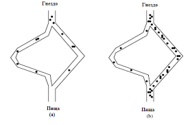

# Муравьиные алгоритмы 
## На чём основан?
*Данный алгоритм основан на поведении колонии муравьёв в реальной жизни, которая пытается найти пропитание.*

*Ссылка на страницу в* [wikipedia](https://ru.wikipedia.org/wiki/%D0%9C%D1%83%D1%80%D0%B0%D0%B2%D1%8C%D0%B8%D0%BD%D1%8B%D0%B9_%D0%B0%D0%BB%D0%B3%D0%BE%D1%80%D0%B8%D1%82%D0%BC) *с более подробным пояснением.*



*На этой картинке показано, как муравьи добираются до пищи, благодоря проложенному муравьём-первопроходцем пути.*

*Этот алгоритм можно реализовать через бибилиотеку* `pygame` *в* **python**

*Вот часть кода, необходимая для запуска окна* `pygame`*:*

```python
import pygame
import sys

pygame.init()

screen = pygame.display.set_mode((600,600))

while True:
    for event in pygame.event.get():
        if event.type == pygame.QUIT:
            pygame.quit()
            sys.exit()
        pygame.display.flip()
```
